# 🌍 AirSense OS: Next-Generation Hyperlocal Environmental Intelligence Platform

> **Empowering Cities, Enterprises, and Citizens with Real-Time Air Quality Sensing, Predictive AI, Satellite Remote Sensing, and Automated Response Workspaces.**

---

## 📌 Executive Summary & Pitch

Air pollution is **not uniform across a city**. A person standing beside a busy traffic signal, a school near a construction site, and a residential colony just a few streets away can experience radically different air quality at the exact same minute. 

Yet, traditional air quality platforms provide only a single, coarse city-level average index. This leaves citizens blind to micro-environmental hazards, prevents schools and hospitals from taking timely preventative measures, and deprives municipal authorities of targeted enforcement data.

**AirSense OS** bridges this gap by creating an end-to-end **Hyperlocal Air Quality Intelligence Platform**. By combining low-cost IoT sensor nodes, meteorological data, satellite imagery (remote sensing for crop burning, dust storms, industrial plumes), and artificial intelligence, AirSense delivers accurate, location-specific air quality insights and predictive early warnings.

---

## 📸 Platform Interface & Dashboard Gallery

| Dashboard / Workspace | Preview | Description |
| :--- | :--- | :--- |
| **Operations Mission Control** | 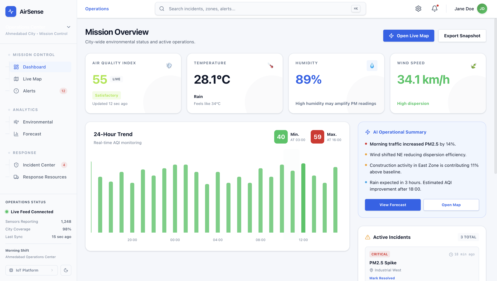 | Real-time situational awareness, key environmental metrics, active incident tracking, and spatial heatmaps. |
| **Live GIS Operations Map** | 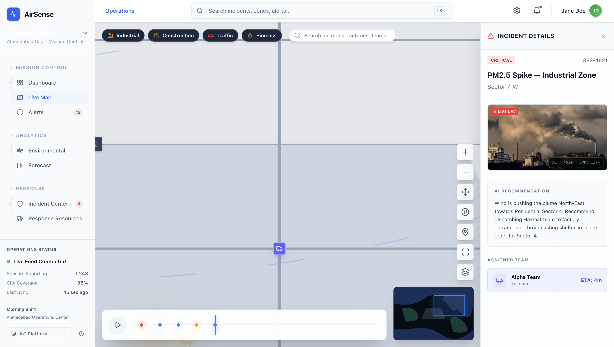 | Interactive spatial viewport with vector sensor overlays, pollution plumes, and site-level telemetry. |
| **Incident Management Center** | 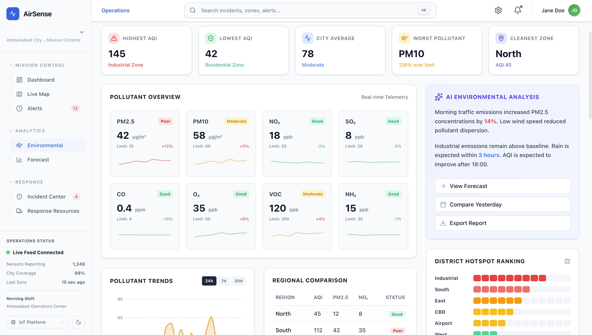 | Automated detection of pollution spikes with dispatch workflows and resource coordination. |
| **AI Environmental Analytics** | 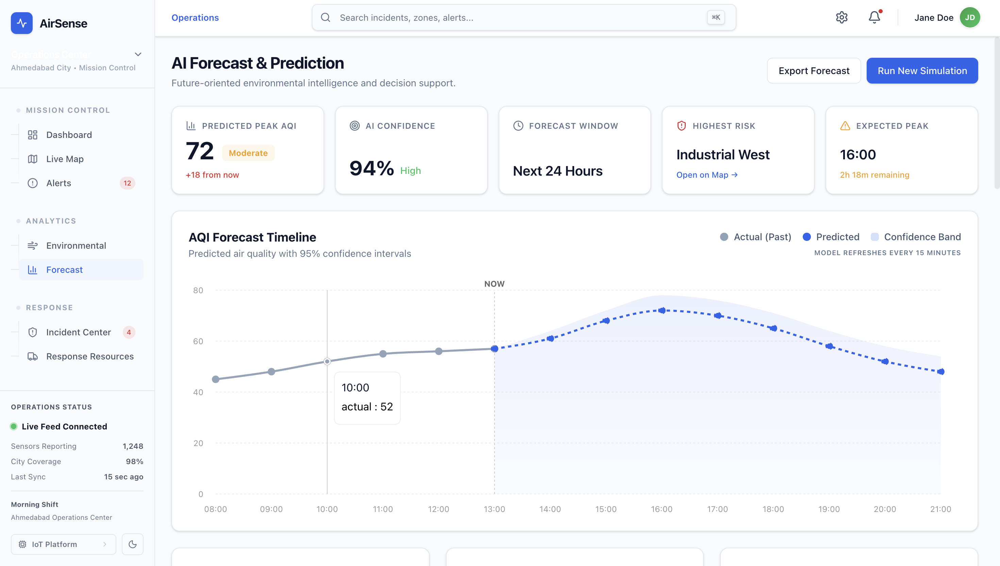 | Deep-dive pollutant analysis (PM2.5, PM10, CO, NO₂), threshold tracking, and multi-station comparison. |
| **Predictive Forecast Workspace** | 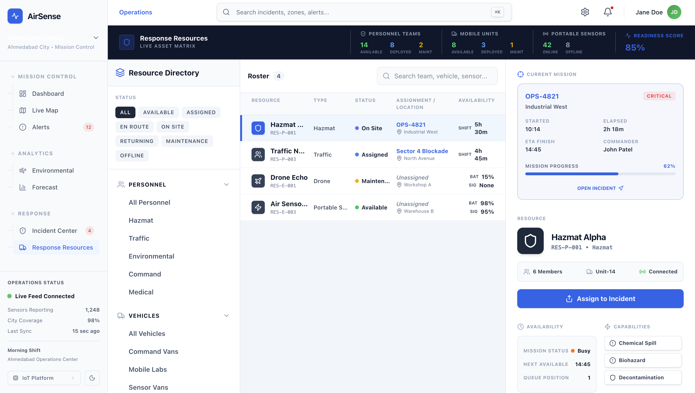 | AI-driven 24-hour predictive trend models with weather correlation and scenario analysis. |
| **Response Resources & Fleet Roster** | 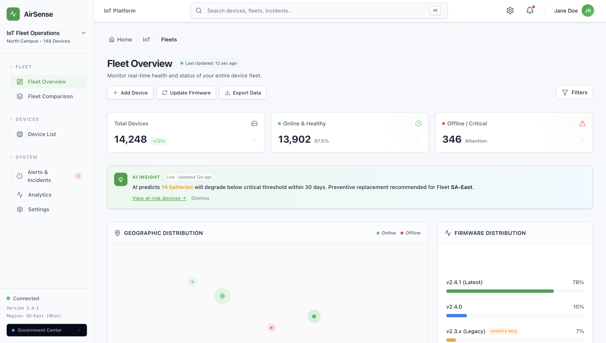 | Field team dispatch, air purification units, UAV sensor drones, and rapid response unit tracking. |
| **Government & Compliance Center** | 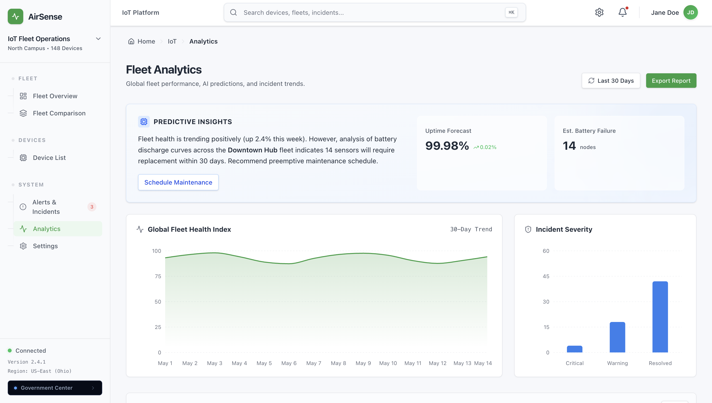 | Regulatory reporting, advisory generation, city project planning, and multi-agency oversight. |
| **Alerts & Anomaly Queue** | 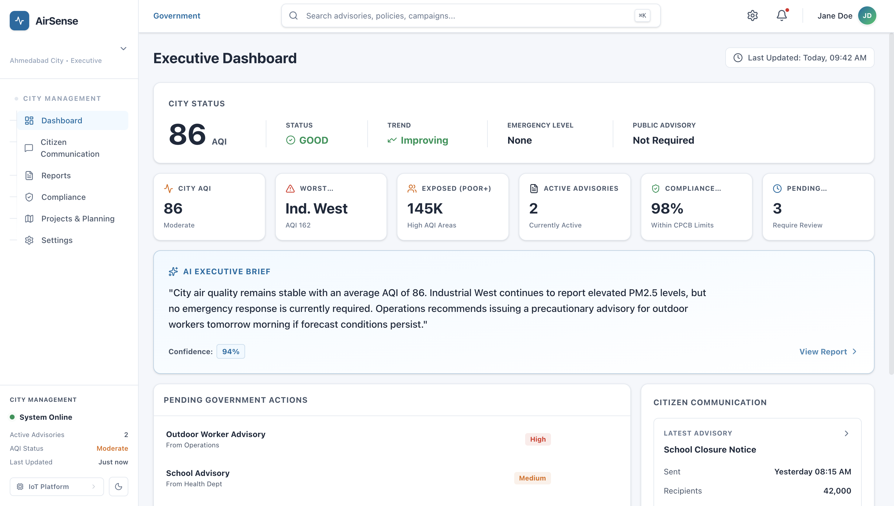 | Priority queue for threshold violations, automated severity classification, and escalation paths. |
| **IoT Device List & Telemetry** | 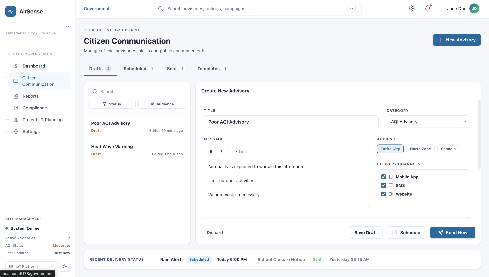 | Fleet health, sensor calibration status, battery/signal metrics, and firmware OTA management. |
| **Fleet Comparison & Benchmarking** | 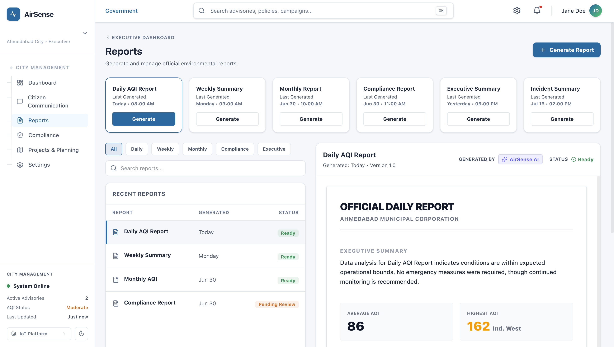 | Side-by-side comparative telemetry across multiple industrial sites or city zones. |
| **Role-Based Authentication & Access** | 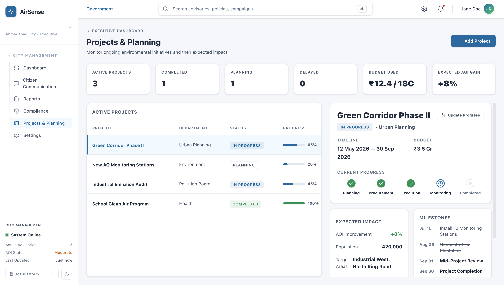 | Enterprise single sign-on (SSO), role selection, and multi-tenant security verification. |

---

## ⚡ How It Works

AirSense OS operates through a seamless 4-tier telemetry and intelligence pipeline:

```
┌────────────────────────────────┐     ┌─────────────────────────────┐
│    IoT Ground Nodes            │     │  External Data Streams      │
│ (PM2.5, PM10, CO, NO₂, Temp)   │     │ (Satellite, Weather, Traffic)│
└───────────────┬────────────────┘     └──────────────┬──────────────┘
                │                                     │
                └──────────────────┬──────────────────┘
                                   │ Real-Time Ingestion
                                   ▼
┌────────────────────────────────────────────────────────────────────┐
│                    AirSense Cloud & AI Engine                      │
│ - Data Fusion & Spatial Interpolation                               │
│ - Neural Anomaly Detection & Source Attribution                    │
│ - Predictive Telemetry Forecasting                                 │
└──────────────────────────────────┬─────────────────────────────────┘
                                   │
                                   ▼
┌────────────────────────────────────────────────────────────────────┐
│                   Multi-Role Enterprise Web Apps                    │
│   [ Operations Center ]   [ IoT Device Platform ]   [ Gov Hub ]    │
└────────────────────────────────────────────────────────────────────┘
```

1. **Compact Sensing Nodes**: Installed at schools, hospitals, offices, construction zones, and traffic hubs. Devices continuously sample environmental parameters (PM2.5, PM10, CO, NO₂, Temperature, Relative Humidity).
2. **Multi-Source Data Fusion**: Ingests ground telemetry alongside satellite observations (Sentinel/MODIS for smoke/dust plumes), weather forecasts, and traffic density data.
3. **AI Reasoning Engine**: Analyzes multi-modal data streams to isolate pollution causes, forecast AQI up to 24 hours ahead, and generate targeted recommendations.
4. **Actionable Dashboards**: Delivers context-specific dashboards tailored for operators, government officials, engineers, and citizens.

---

## 🏫 A Real-World Scenario

Imagine a parent whose child studies at an urban school near a major highway:

- **Traditional AQI**: Shows a city average of `110` ("Moderate"), suggesting normal outdoor activities.
- **AirSense Detection**: The AirSense IoT sensor at the school detects a PM2.5 spike (`245`) due to nearby roadwork combined with low wind speeds and school-bus idle traffic.
- **Predictive AI Warning**: The AI engine forecasts that air quality will worsen over the next 2 hours during dismissal time.
- **Automated Action**: The school receives an immediate automated advisory recommending that outdoor sports be rescheduled, HVAC filtration be switched to high efficiency, and sensitive students be kept indoors.

> **Result**: Air quality monitoring evolves from passive status reporting to proactive health intervention.

---

## 🛠️ Hardware Architecture & Sensing Nodes

The AirSense hardware is designed for low cost, easy deployment, and continuous field operation:

- **Core Microcontroller**: High-performance Wi-Fi / LTE-M cellular IoT module with secure hardware element.
- **Optical Dust Sensor**: Laser scattering particle sensor for high-precision PM1.0, PM2.5, and PM10 measurement.
- **Gas Sensor Array**: Electrochemical sensors for CO, NO₂, O₃, and VOC detection.
- **Environmental Suite**: High-accuracy temperature, humidity, and barometric pressure sensors.
- **Power Management**: Solar-assisted battery backup for uninterrupted 24/7 operation.

---

## 🧠 AI-Powered Intelligence Core

AirSense doesn't just display sensor graphs; it turns raw data into actionable intelligence:

- **Predictive AQI Modeling**: Neural time-series forecasting projects AQI up to 24 hours into the future.
- **Pollution Source Attribution**: Differentiates between vehicle exhaust, biomass/crop burning, dust, and industrial emissions.
- **Automated Anomaly Detection**: Flags sensor drift, sudden spikes, or hardware malfunctions in real time.
- **Dynamic Health Advisories**: Formulates customized advisories based on WHO and national standards.

---

## 💻 Code Snippets & Architecture Highlights

### 1. Role-Based Navigation & Switching (`AppSidebar.tsx`)
```tsx
{/* Cross-platform switcher — always visible */}
<div className="space-y-1.5">
  <p className="text-[9px] font-semibold uppercase tracking-widest mb-1 opacity-60">Switch Platform</p>
  <Link to="/iot/fleets" className="flex items-center gap-2 py-1.5 px-2.5 rounded-md border text-[11px] font-semibold">
    <Cpu className="w-3 h-3 flex-shrink-0" />
    IoT Platform
  </Link>
  <Link to="/operations" className="flex items-center gap-2 py-1.5 px-2.5 rounded-md border text-[11px] font-semibold">
    <ShieldAlert className="w-3 h-3 flex-shrink-0" />
    Operations
  </Link>
  <Link to="/government" className="flex items-center gap-2 py-1.5 px-2.5 rounded-md border text-[11px] font-semibold">
    Government Center
  </Link>
</div>
```

### 2. Standardized API Response Serialization (`core/responses.py` - Backend)
```python
@classmethod
def success(
    cls, 
    request_id: str,
    data: Any = None, 
    meta: dict[str, Any] | None = None,
    status_code: int = status.HTTP_200_OK
) -> JSONResponse:
    content = cls(
        is_success=True,
        request_id=request_id,
        timestamp=datetime.now(timezone.utc).isoformat(),
        data=data if data is not None else {},
        meta=meta if meta is not None else {}
    ).model_dump(mode="json", exclude_none=True, by_alias=True)
    return JSONResponse(status_code=status_code, content=content)
```

---

## 💼 Business Perspective & Market Value

AirSense serves diverse enterprise and public sector stakeholders:

| Stakeholder | Value Proposition |
| :--- | :--- |
| **Schools & Universities** | Protect student health by scheduling sports based on predicted air quality. |
| **Hospitals & Clinics** | Prepare respiratory care wards prior to predicted pollution surges. |
| **Industrial Facilities** | Monitor perimeter emissions and maintain strict regulatory compliance. |
| **Construction Companies** | Control dust generation and receive alerts before regulatory threshold breaches. |
| **Smart City Authorities** | Deploy high-density monitoring networks at a fraction of traditional station costs. |
| **Citizens** | Access accurate, neighborhood-level AQI and tailored personal health advisories. |

---

## 💰 Business Model & Revenue Strategy

1. **Hardware Node Sales**: Direct sale of low-cost, plug-and-play IoT sensing units to enterprises and smart cities.
2. **SaaS Dashboard Subscription**: Tiered monthly/annual subscriptions for accessing live dashboards, predictive analytics, and automated compliance reporting.
3. **Enterprise & Municipal Solutions**: Custom multi-site deployments, dedicated SLA support, and custom GIS integrations.
4. **API & Data Services**: Paid API access for weather apps, research institutions, insurance providers, and real estate platforms.
5. **Carbon Capture Integration & Marketplace**: Integrating modular carbon capture hardware units with AirSense nodes to process and supply captured CO₂ to industrial buyers (beverages, greenhouses, synthetic fuels).

---

## 📊 Feature Comparison Matrix

| Feature | Traditional AQI Apps | AirSense OS |
| :--- | :---: | :---: |
| Spatial Granularity | City-wide (Single Index) | **Hyperlocal (Building/Street Level)** |
| Data Sources | Single Station Average | **IoT Nodes + Satellite + Weather + Traffic** |
| Predictive Capability | Historical / Reactive | **24-Hour AI Predictive Forecasting** |
| Incident Workflows | None | **Automated Dispatch & Incident Center** |
| Role-Based Interfaces | Generic View | **Tailored Ops, IoT & Gov Workspaces** |

---

## 🚀 Getting Started & Local Operations Guide

Follow these steps to pull, run, and test the full AirSense OS platform locally.

### 1. Prerequisites
- **Node.js**: `v18+`
- **npm**: `v9+`
- **Python**: `v3.10+` (Python 3.14 compatible)
- **Git**

---

### 2. Pulling & Running the Frontend

```bash
# Clone the repository
git clone https://github.com/ArsheelPatel06/AirSense-OS.git
cd AirSense-OS

# Install dependencies
npm install

# Start the Vite development server
npm run dev
```

The frontend will be available at: **`http://localhost:5173`**

---

### 3. Setting Up & Running the Backend Server

```bash
# Navigate to the backend directory
cd ../AirSenseBackend

# Create and activate virtual environment
python3 -m venv .venv
source .venv/bin/activate

# Install dependencies
pip install -r requirements.txt

# Start FastAPI backend with hot reload
uvicorn main:app --host 0.0.0.0 --port 8000 --reload
```

The API server will run at: **`http://localhost:8000`**  
Interactive API Docs: **`http://localhost:8000/docs`**

---

### 4. Testing & Operating the Platform

1. **Sign Up / Log In**:
   - Navigate to `http://localhost:5173/login`.
   - Register a new account selecting your desired role (e.g. `Super Admin`, `Operations Manager`, `IoT Engineer`, `Government Official`).
   - Sign in with your credentials.

2. **Explore Dashboards**:
   - **Operations Center**: Visit `http://localhost:5173/operations` for real-time map controls, live incident queues, and environmental forecasts.
   - **IoT Platform**: Visit `http://localhost:5173/iot/fleets` to view device lists, telemetry graphs, and hardware calibration status.
   - **Government Center**: Visit `http://localhost:5173/government` for executive metrics, advisories, and city project tracking.
   - **Platform Switcher**: Use the **Switch Platform** menu at the bottom of the sidebar to jump between platforms seamlessly.

---

## 🤝 Author & License

Developed with ❤️ by **Arsheel Patel**.  
Licensed under the [MIT License](LICENSE).
